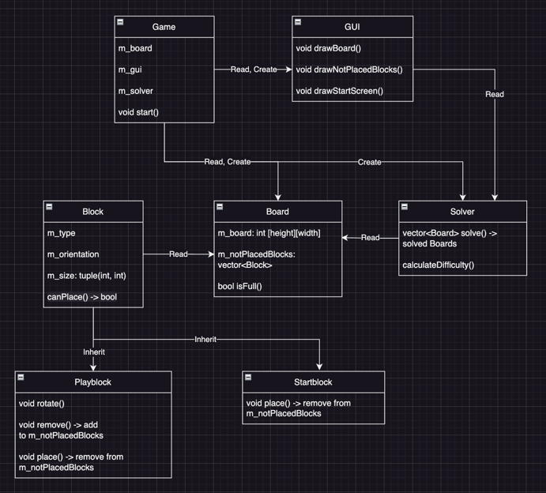

# C++ Final Exam
ITA22 DHBW-Stuttgart

student number: 
  - 5622763
  - 9431638
  - 1788761

## Contributers
- [Dinar Karchevskii](https://github.com/karchevskii)
- [Philipp Konstantin Gehrig](https://github.com/philippgehrig) 
- [Mattes Wirths](https://github.com/MWirths)

## Task

We created a game to play "Mondrian Blocks". Furthermore we implemented a solver to asses the difficulty of a given game
and give a solution to it.

## UML Diagramm

## Getting Started

### Prequisites

### Installation

### Usage

### Examples

## Contributions
Unfortunately, we cannot accept any contributions at the moment. However, if you have any suggestions you can open an issue.
